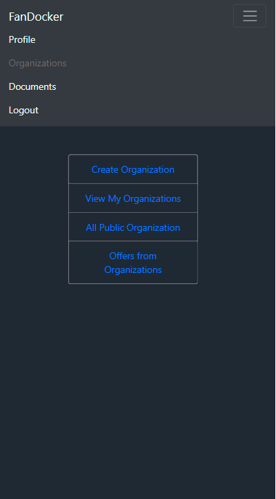
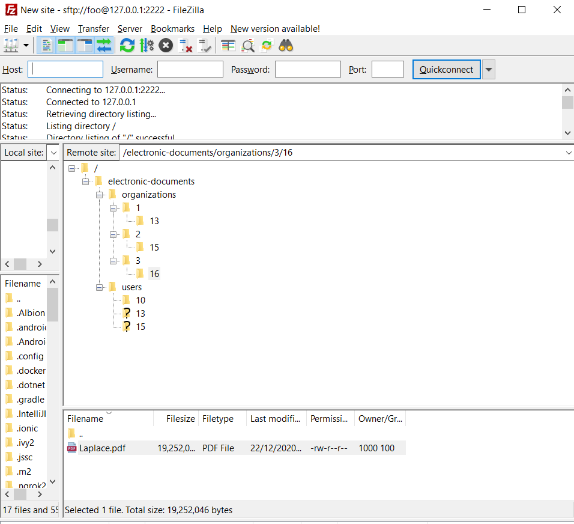

# electronic-documents-mobile
клиент сервеное приложение. с различными компонентами.
* телефон - Ionic
* web client - angular 8
* server - spring boot
* mysql 8 - бд
* sftp - хранение данных(документов)
* openssl - создание и управление сертификатами для эцп
* docker - развертывание web, sftp, mysql

идея проекта создать приложение по управлению докуменами и их подпианию, разграничив их по организациям.

 логин - активность для логина

 profile - активность для упраление своимпровилем

 organizations - панель с вклажками по управлению организациями

 create_organization - создание организации

 organization general главное о организации

 organization members участники, админ может управлять их ролями, которые нужны для подписания

 upload document загрузка документа пока только пдф до 300 мб

 send to signature отправка другим пользователям организации на подписание по роли

 my organizations организации польщователя, где он состоит

 all organizations все публичные организации ( private не будет здесь отбражаться

 documents  документы органихцаии прошедшие все этапы подписи

 organization settings управление организацией для админа

 organization settings roles упралвение ролями для админа

 show sftp - показываю, что работает sftp

 docker containers - показываю, что контейнеры запущены в общем пространстве

 settings requests упралвение заявками в организацию

 request to user запрос оторганизации пользователю

 доумент в ожидании ожидание подписания другими участниками

 подписание  - процесс подписания своим приватным ключом по паролю

 bd in docker - демонстрация mysql из под докер и что поля там зашифрованы, а пароль в хеше

 signatured document уже подписанный документ готовый к использованию. используется пнг с фамилией и инициалами, которая создается при регистрации пользователя

